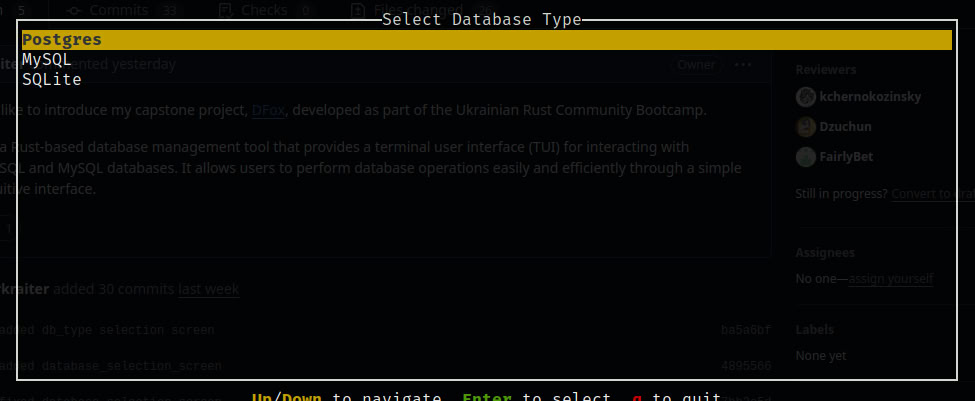
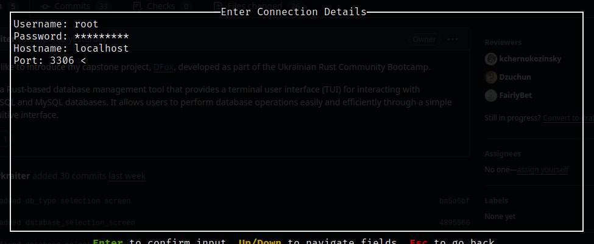
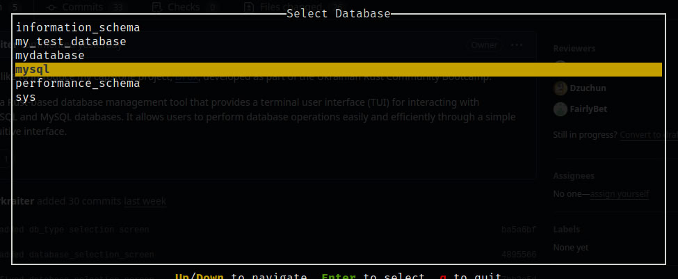
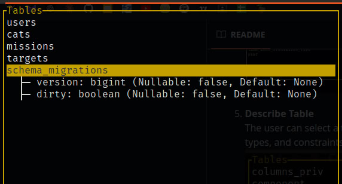
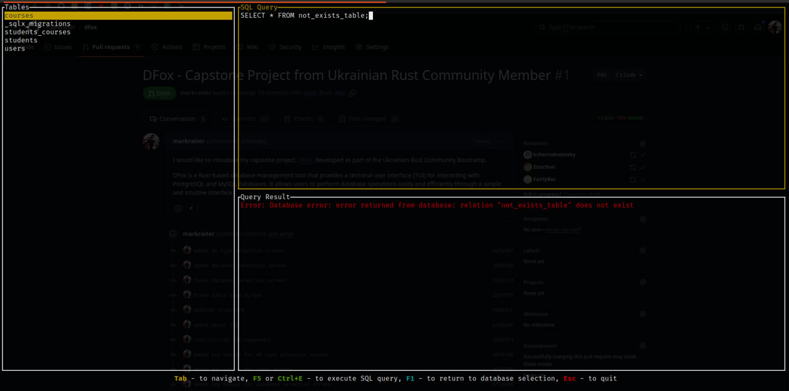

<p align="center">
  
</p>

# DFox - ⚡️ Blazing Fast Terminal Database Manager

[](https://opensource.org/licenses/Apache-2.0) 


**DFox** is a Rust-based database management tool that provides a terminal user interface (TUI) for interacting with PostgreSQL and MySQL databases.
It allows users to perform database operations easily and efficiently through a simple and intuitive interface.

## Features

- Connect to multiple database types: PostgreSQL, MySQL, (SQLite still in development).
- User-friendly terminal interface for managing database connections and performing CRUD operations.
- Dynamic rendering of database schemas and table data.
- Easily extendable for additional database types and features.
- Built-in debug logging system for troubleshooting.

## Project Structure

The project is organized as a Cargo workspace consisting of two main components:

- **dfox-core**: The core library responsible for database operations. It includes implementations for MySQL, PostgreSQL, and SQLite clients, as well as data models and error handling.
- **dfox-tui**: The command-line interface for user interaction. It contains the main functions for launching the application, along with UI components and event handlers.

## Debug Logging

DFox includes a comprehensive logging system to help with troubleshooting and development. By default, logging is disabled for better performance. To enable debug logging:

1. Create a `.env` file in the project root directory:
```bash
# .env file
RUST_LOG=debug
```

2. Run the application as usual. Debug logs will be written to `dfox-debug.log` in the current directory.

3. You can also view debug information directly in the application by pressing **F12** while using the interface.

### Log Levels
- `off` - No logging (default)
- `error` - Only errors
- `warn` - Warnings and errors
- `info` - General information, warnings, and errors  
- `debug` - Detailed debugging information (recommended for troubleshooting)
- `trace` - Very verbose logging

Example `.env` configurations:
```bash
# For normal usage (default)
RUST_LOG=off

# For basic error tracking
RUST_LOG=error

# For troubleshooting
RUST_LOG=debug

# For development
RUST_LOG=trace
```

## How It Works

1. **Database Type Selection**  
   Upon starting the application, the user is presented with a menu to select the database type (PostgreSQL, MySQL, or SQLite). Use the up/down keys to navigate and Enter to confirm your choice.  
   

2. **Connection Input Screen**  
   After selecting the database type, the user is prompted to input the connection details such as hostname, port, username, and password.  
   

3. **Database Selection**  
   Once connected, a list of available databases is displayed. The user can choose the database to interact with.  
   

4. **Table View**  
   The application dynamically renders the list of tables available in the selected database.  
   

5. **Describe Table**  
   The user can select a table to view its schema, displayed in a tree-like structure, including column names, types, and constraints.  
   

6. **Query Execution and Results**  
   The user can execute SQL queries and view the results in the TUI.  
   

7. **Error Handling**  
   If there is an error with the query or database operation, an error message is displayed in the interface.  
   

## Keyboard Shortcuts

DFox provides several keyboard shortcuts for efficient navigation and operation:

### General Navigation
- **Tab** - Navigate between interface elements
- **↑/↓** - Navigate up/down in lists and tables
- **←/→** - Horizontal scroll in query results
- **Page Up/Page Down** - Scroll pages in results
- **Home/End** - Jump to beginning/end of results

### Query Operations  
- **F5** or **Ctrl+E** - Execute SQL query
- **Ctrl+C** - Copy selected row to clipboard
- **Ctrl+A** - Copy all query results to clipboard

### Interface Controls
- **F1** - Return to database selection
- **F12** - Toggle debug information display
- **Esc** or **q** - Quit application

### SQL Editor
- Standard text editing controls
- **Enter** - New line
- **Backspace/Delete** - Character deletion

## Installation

To build and run the project, ensure you have [Rust](https://www.rust-lang.org/) installed. Clone the repository and use Cargo to build the project:

```bash
git clone https://github.com/markraiter/dfox.git
cd dfox
cargo build
```

## Usage

After building the project, you can run the TUI application with the following command:

```bash
cargo run --bin dfox-tui
```

## Contributing

Contributions are welcome! If you would like to contribute to DFox, please follow these steps:

1. Fork the repository.
2. Create your feature branch (git checkout -b feature/my-feature).
3. Commit your changes (git commit -m 'Add some feature').
4. Push to the branch (git push origin feature/my-feature).
5. Open a pull request.

 ## Acknowledgments

Thanks to the [Ukrainian Rust Community](https://github.com/rust-lang-ua) for their incredible support and resources.
